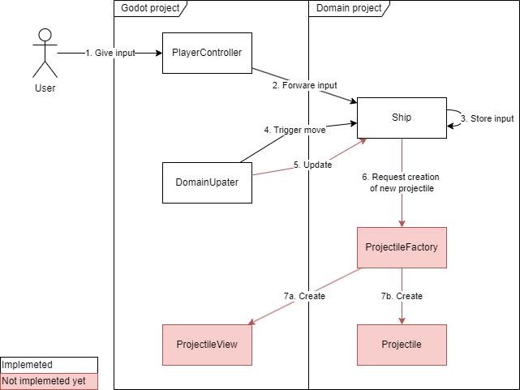

# Basic Shmup (Shoot 'em up)

The current target of the game is a very simple shoot 'em up, with game play in the style of Galaga.
We are still in the early stages of the development, so this target can change, depending on interest in the project,
and idea for the project.

## Contribution guide
See the [CONTRIBUTING.md](./CONTRIBUTING.md) file.

## Project and code structure

### Project split
The code of the project is split in two main projects, the Godot project (`/BasicShmup/BasicShmup.csproj`) and the
domain project (`/BasicShmup.Domain/BasicShmup.Domain.csproj`).
The Godot project contains the presentation logic, it handles user input, and other integration with Godot.
The domain project handles the actual game logic.

Unfortunately Godot (just like Unity) promotes a quite fragile design, with high coupling between nodes/classes, and
where each node has many responsibilities.
The split into presentation and domain forces a
[model-view-controller](https://en.wikipedia.org/wiki/Model%E2%80%93view%E2%80%93controller) like patten on the code,
making it easier to follow principles like the
[Single-responsibility principle (SRP)](https://en.wikipedia.org/wiki/Single-responsibility_principle), and keep
coupling between domain classes down.

### Call journey

A typical frame update should follow the call journey depicted below.
This image focuses on a `Ship`-entity, bot other entities should have similar call journeys.
Here a user give input to a Controller node, which forwards this input, to a domain entity.
The domain entity does _not_ react to this input initially, but instead just stores it.
After all other controllers have forwarded their inputs, to relevant entities, the `DomainUpdater` node triggers all
entities to apply the input, first by calls to `Move` then `Update`.

The call to `Update` could then trigger the spawning of a `Projectile`-entity, which is handled by `Factory`,
responsible for create both a domain entity, and a view/node for presenting the projectile to the user.

*Currently, the journey is only implemented up until calls to `Move`, while the rest is a best guess, at a good
structure.
The project is still very young, so everything is subject to change*

